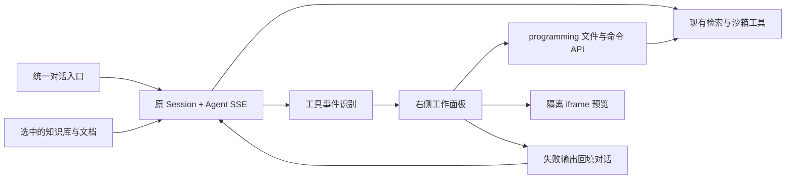

# WeKnora 对话式工作台：方案与实现

## 产品方案

以 [Manus](https://manus.im/) 的对话优先、留白和渐进展开方式为设计参考，保留 WeKnora 品牌和现有知识库能力。用户从一段对话出发，完成资料检索、代码生成、预览、测试和修复。

主界面采用“左侧导航 / 中间对话 / 按需展开的右侧工作面板”。不再提供 Monaco 或 VS Code 式 IDE。编程与知识库使用同一个正常 Agent 会话，避免进入隔离知识库的旧 Coding 模式。

首页提供四个可编辑的任务起点：

| 入口 | 行为 |
| --- | --- |
| 创建网站 | 在输入框填入建站任务，首次发送后展开预览面板 |
| 编写代码 | 填入编程任务，首次发送后展开代码面板 |
| 运行测试 | 填入检查、执行、分析、修复任务，首次发送后展开测试面板 |
| 知识库问答 | 填入带引用要求的问题模板，继续使用输入框已有的知识库选择器 |

任务模板不会自动发送。直接输入“创建网站、编写脚本、运行测试”等明确任务也会识别对应意图；仅提到代码概念的普通问题不会触发编程。选择编程入口时，仅在当前为内置快速问答时切换到智能推理，并保留已选知识库、文件、标签、MCP 和技能。自定义智能体的选择保持有效。

## 已实现的交互

- 主入口 `/` 和登录完成后进入 `/platform/creatChat`。
- 原 `/platform/programming` 转到统一对话；带 `?session=<id>` 的旧链接进入对应会话。
- 编程工具 `write_sandbox_file`、`edit_sandbox_file`、`read_sandbox_file`、`list_sandbox_files`、`shell_exec`、`execute_code` 的 SSE 事件触发工作面板。
- 手动关闭面板后，同一轮工具事件不会反复打断用户；新一轮编程可以再次自动打开。
- 文件工具返回后刷新真实工作区；打开历史编程会话时，根据历史工具记录恢复面板。
- 右侧具有预览、代码、测试、产物、终端页签；支持桌面的额外页签仍由原智能体沙箱配置决定。
- 面板可拖拽调宽。窄屏覆盖显示，并提供关闭按钮与 Escape 退出。
- 代码页使用 Manus 式文件树：目录按层展开、按需懒加载，只显示项目本身，会话的 `input`（附件暂存）与 `output`（产物）目录不参与展示；支持语法高亮、行号、复制及下载。代码为只读，修改通过对话交给 Agent。
- 预览支持 HTML、SVG、Markdown，以及 HTML 直接引用的本地 CSS、JavaScript 和 SVG。支持桌面/手机宽度切换与重新预览。
- 测试页支持手动执行命令，也显示对话里 Agent 的命令执行记录。失败、超时、状态未知与成功分开显示；不会把缺失结果当成成功。
- 手动测试记录在关闭/重开面板时保留，切换会话后清空。请求返回前切换会话，不会把旧输出写进新会话。
- “让 Agent 分析并修复”将命令、退出码及末尾最多 12,000 字符的输出放回输入框，用户可编辑后发送。
- 知识库、文件上传、引用来源、流式回答、中断、产物、原终端等既有流程继续复用。

## 技术实现



沿用 Vue 3、Pinia、TDesign、highlight.js、Go 后端及现有沙箱实现。本轮无需数据库迁移、额外服务或新前端依赖。

| 文件 | 职责 |
| --- | --- |
| `frontend/src/components/workspace/WorkspaceWelcome.vue` | 对话首页、任务入口与组合式输入区 |
| `frontend/src/components/workspace/ConversationWorkspace.vue` | 文件阅读、页面预览、测试及请求状态 |
| `frontend/src/components/chat/SandboxSidePanel.vue` | 共用右侧面板与页签、调宽、关闭、保留结果 |
| `frontend/src/utils/workspaceEvents.ts` | 编程事件判定、历史恢复、真实命令状态映射 |
| `frontend/src/utils/workspaceIntent.ts` | 自然语言任务识别及保留知识库上下文的智能体切换 |
| `frontend/src/utils/workspacePreview.ts` | 本地资源解析、预览文档生成和 CSP |
| `frontend/src/views/chat/index.vue` | 接入 SSE 与历史消息、面板自动展开、修复回填 |
| `frontend/src/assets/theme/workspace-theme.css` | 全局浅色/深色中性色、边框、圆角、输入区与导航规范 |
| `frontend/src/i18n/workspace.ts` | 中文和英文文案；其他语言使用英文工作台文案 |

复用的接口：

```text
POST /api/v1/sessions
POST /api/v1/agent-chat/:session_id                  # 既有 SSE
GET  /api/v1/sessions/:id/programming/tree?path=...
GET  /api/v1/sessions/:id/programming/file?path=...
POST /api/v1/sessions/:id/programming/command
```

文件接口沿用会话所有权、工作区路径校验和 2 MB 文本文件上限。高亮显示最多 200,000 字符，较大的文件仍可完整下载。测试命令由后端在当前会话工作区执行，最长 60 秒；前端请求超时设为 70 秒，避免后端尚在运行时前端先超时。

右侧查看文件不会自行创建或恢复沙箱；执行需要已经就绪的会话工作区。未配置模型、智能体沙箱或工作区尚未建立时，会显示明确的不可用状态。

## UI 统一规范

- 页面白色、侧栏暖灰、石墨色主要操作；成功、错误等语义颜色单独保留。
- 字号、圆角与动效统一使用原项目设计令牌；新增 `--app-radius-2xl` 和共用表面阴影。
- 对话和工作面板共享 52 px 标题行。知识库、智能体、设置的按钮、输入框、弹窗跟随同一组主题变量。
- 侧栏图标使用中性色，保留原本可折叠/调宽/搜索和历史管理能力。
- 保留原有字体设置与深色模式；首页标题使用衬线字体增加层级。
- 没有引入额外框架、远程字体或新的图标依赖。

## 预览边界

预览使用 `sandbox="allow-scripts"` 的 iframe，不授予 `allow-same-origin`、表单提交或顶层导航权限，因此生成页面无法读取主应用的 DOM、Cookie 或本地存储。CSP 限制网络子资源、fetch、内嵌 frame 和对象；外部 CDN 依赖不会加载。相对资源路径限制在工作区内，每次预览最多读取 24 个关联资源、总计最多约 4 MB 文本。

当前版本面向独立静态页面。React/Vue/TypeScript 源文件可以查看，但不会在浏览器内自动安装依赖或编译；需要在对话中让 Agent 构建成独立 HTML，再预览产物。二进制资源不通过文本文件接口加载，图片可使用内联 data URL 或本地 SVG。包含本地 ES module import、CSS 二级资源等复杂依赖时，需要先打包为自包含页面。

手动测试记录保留在当前页面内存中，刷新页面不会恢复；Agent 执行记录通过原消息历史保存。本轮没有添加测试记录数据库、项目版本表、远程开发服务代理或自动部署。

## 本地验证与使用

正式入口：`http://localhost:5173/platform/creatChat`，需要登录现有账号，并在设置中配置可用模型及智能体沙箱。

开发验收入口：`http://localhost:5173/platform/dev/workspace`。仅在 Vite 开发模式注册；生产构建不包含该路由。它复用正式首页与右侧面板，使用标注清楚的示例文件和模拟接口，不绕过正式页面认证、不调用模型、不访问真实沙箱。`demo-test` 和 `demo-fail` 仅用于该验收页的成功/失败状态演示。

```bash
cd frontend
npm run dev
node --import tsx --test src/utils/workspaceIntent.test.ts src/utils/workspaceEvents.test.ts src/components/workspace/ConversationWorkspace.test.mjs src/composables/useChatSandboxPanel.test.mjs src/components/chat/SandboxSidePanel.test.mjs src/views/creatChat/creatChat.test.mjs src/assets/theme/styleGuard.test.mjs src/i18n/localeKeyAudit.test.ts
npm run type-check
NODE_OPTIONS=--max-old-space-size=6144 npm run build
```

本地原有构建在 Node 默认约 2 GB 堆限制下内存不足，使用上述 6 GB 上限可完成生产构建。现有 Mermaid、图标等大 chunk 告警仍保留；本轮已经移除 Monaco 的代码、Worker 和依赖引用。

原文件备份位于 `/tmp/weknora-conversation-backup`，因为本地目录没有 Git 元数据。该临时备份不应当作为长期版本管理。

验收边界：已在浏览器验证桌面对话/右侧布局、HTML + CSS + JS 预览交互及源码切换。后续浏览器操作被自动审批服务额度限制拦截；测试状态和会话隔离改用组件逻辑自动测试验证。按本次要求未登录账号、未调用真实模型及真实沙箱。真实环境的生成 → 预览 → 执行测试闭环仍需使用已配置账号验收。

最终验证：TypeScript 类型检查通过；生产构建通过；产物不含 Monaco 或开发验收页。相关回归共 88 项通过，包含文件/命令异步状态、会话隔离、预览路径、Agent 事件、知识库上下文保留、多语言键、设计令牌和原对话流回归。
